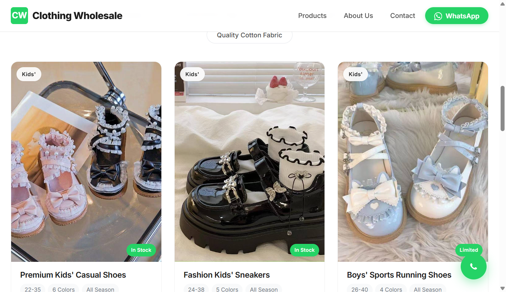
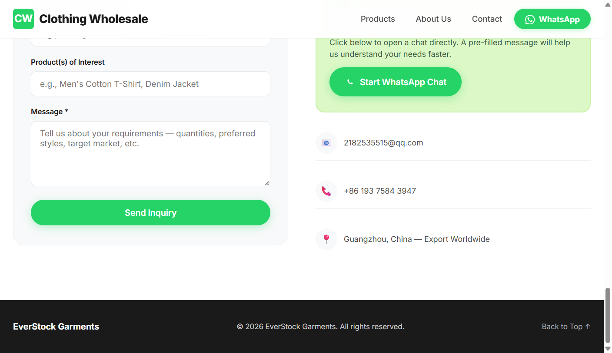

# EverStock Garments 网站使用手册

## 项目简介

这是一个服装批发商品展示网站，纯静态、免后台。商品数据存储在 CSV 表格中，用 WPS/Excel 即可编辑维护。

---

## 文件说明

| 文件 | 作用 | 谁用 |
|------|------|------|
| `products.csv` | 商品数据表格 | 老板用 WPS/Excel 编辑 |
| `index.html` | 网站主页面 | 一般不需要动 |
| `products.js` | 自动生成的数据文件 | 由脚本自动生成，不用手动改 |
| `csv2js.py` | CSV 转 JS 的脚本 | 自动调用 |
| `更新预览.bat` | 一键转换并预览 | 双击运行 |
| `部署上传.bat` | 一键部署到服务器 | 双击运行 |
| `img/` | 商品图片文件夹 | 放商品图 |

---

## 日常操作流程

### 第一步：打开商品表格

1. 打开项目文件夹，找到 `products.csv` 文件
2. **双击**打开，系统会自动用 WPS 表格或 Excel 打开

**打开后的效果：**



---

### 第二步：了解表格列含义

| 列名 | 说明 | 示例 |
|------|------|------|
| name | 商品名称 | Premium Kids' Casual Shoes |
| image | 图片文件路径 | img/儿童鞋1.jpg |
| category | 分类标签（必须填） | kids-shoes |
| tag | 商品卡片左上角标签 | Kids' / Baby / Women's |
| stockBadge | 库存状态 | In Stock / Limited |
| sizes | 尺码范围 | S-XXL / 22-35 / 3M-24M |
| colors | 颜色数量 | 6 Colors |
| season | 季节 | Summer / Winter / All Season |
| desc | 商品描述 | High-quality casual shoes... |
| moq | 起订量 | 300 pcs |

---

### 第三步：上架新商品（新增）

#### 步骤 1：准备商品图片
1. 打开 `img/` 文件夹
2. 将商品图片复制粘贴到这个文件夹里
3. 建议图片命名格式：`类目名+序号.jpg`，例如：`儿童鞋1.jpg`、`儿童鞋2.jpg`

#### 步骤 2：在表格中添加商品
1. 在表格最后一行下方**点击**，开始新的一行
2. 按列填写信息：
   - **name**: 填写商品名称（如：男童运动套装）
   - **image**: 填写 `img/图片文件名`（如：`img/男童套装1.jpg`）
   - **category**: 从下方分类列表中选择一个填进去
   - **tag**: 选择商品标签（Kids' / Baby / Women's / Men's / Unisex / Fabric）
   - **stockBadge**: 填 `In Stock` 或 `Limited`
   - **sizes**: 填尺码范围（如：3-12Y）
   - **colors**: 填颜色数量（如：6 Colors）
   - **season**: 填季节（Summer / Winter / Spring/Fall / All Season）
   - **desc**: 填写商品描述
   - **moq**: 填写起订量（如：200 pcs）

#### 步骤 3：保存表格
1. 按 `Ctrl + S` 保存
2. 如果弹出提示，选择「是」保持 CSV 格式

---

### 第四步：修改商品信息

1. 在表格中找到要修改的商品行
2. **直接修改**对应单元格的内容
3. 按 `Ctrl + S` 保存

---

### 第五步：下架商品（删除）

1. 在表格中找到要删除的商品行
2. 点击行号选中整行
3. 按 `Delete` 键删除
4. 按 `Ctrl + S` 保存

---

### 第六步：本地预览效果

**最简单的方法：双击 `更新预览.bat`**

双击后会自动完成：
1. 将 CSV 数据转为 JS 格式
2. 打开浏览器展示网站

**网站首页效果：**



**过滤标签效果（点击后只显示对应分类）：**


看到效果不对就回去改 CSV，再双击一次。

---

### 第七步：部署上线

本地预览确认没问题后：

**方法一：双击 `部署上传.bat`**
- 双击后会自动转换 CSV 并上传到服务器
- 服务器地址：`http://1.12.47.237`

**方法二：手动上传**
1. 确认以下文件都已准备好：
   - `products.csv`（改了的商品数据）
   - `products.js`（自动更新了）
   - `img/` 里新加的图片
2. 使用 FTP 工具或控制面板上传到服务器

---

## 商品分类列表（category 列必须填这些）

> ⚠️ 注意：只有下面带过滤标签的分类才能在网站上单独筛选，其他分类只能在「All Products」中显示。

| category 值 | 过滤标签名称 | 说明 |
|-------------|-------------|------|
| kids-shoes | Sturdy Kids' Shoes | 儿童鞋 |
| baby-rompers | Baby Romper & Bodysuit Sets | 婴儿套装 |
| girls-princess | Adorable Girls' Princess Dresses | 儿童公主裙 |
| girls-printed | Pretty Floral Print Dresses | 花布连衣裙 |
| boys-sets | Smart Boys' 2-Piece Sets | 男童套装 |
| womens-dresses | Elegant Women's Dresses | 成人连衣裙 |
| boys-formal | Boys' Formal Suits | 男童西装 |
| school-bags | Classic School Bags | 书包 |
| stylish-backpacks | Stylish Everyday Backpacks | 潮流背包 |
| branded-bags | Branded Fashion Bags | 品牌包 |
| handbag-sets | Cute Girls' Handbag Sets | 儿童手袋套装 |
| kids-slippers | Comfy Kids' Slippers | 儿童拖鞋 |
| cotton-fabric | Quality Cotton Fabric | 纯棉布料 |
| mens summer | (无过滤标签) | 男装夏季 |
| womens summer | (无过滤标签) | 女装夏季 |
| womens winter | (无过滤标签) | 女装冬季 |
| kids summer | (无过滤标签) | 童装夏季 |
| unisex winter | (无过滤标签) | 中性冬季 |

---

## 完整上货流程示例

假设你要上架一款「新款女童连衣裙」：

**第一步：准备图片**
1. 把图片重命名为 `女童连衣裙4.jpg`
2. 复制到 `img/` 文件夹

**第二步：填写表格**
在表格最后添加一行：

| 列名 | 填写内容 |
|------|----------|
| name | Girls' New Fashion Dress |
| image | img/女童连衣裙4.jpg |
| category | girls-printed |
| tag | Girls' |
| stockBadge | In Stock |
| sizes | 4-12Y |
| colors | 5 Colors |
| season | Summer |
| desc | New arrival girls' dress with beautiful floral print. Lightweight and comfortable for summer. |
| moq | 200 pcs |

**第三步：保存并预览**
1. 按 `Ctrl + S` 保存
2. 双击 `更新预览.bat`
3. 在浏览器中找到「Pretty Floral Print Dresses」分类，查看新商品是否显示

**第四步：部署上线**
1. 确认效果无误后，双击 `部署上传.bat`
2. 等待上传完成即可

---

## 修改 WhatsApp 号码

用记事本打开 `index.html`，搜索 `WHATSAPP_NUMBER`，找到这一行：

```js
var WHATSAPP_NUMBER = '8619375843947';
```

把 `8619375843947` 改成实际的 WhatsApp 号码（国家代码 + 手机号，不写加号），保存即可。

---

## 常见问题

**Q: 双击 HTML 文件看不到商品？**

A: 不要直接双击 HTML。请双击 `更新预览.bat` 来预览。

**Q: 双击 `更新预览.bat` 提示找不到 Python？**

A: 需要安装 Python。去 https://python.org 下载安装即可。安装时一定要勾选「Add Python to PATH」。

**Q: WPS 打开 CSV 是乱码？**

A: 用 WPS 表格打开时，选择「数据」→「导入数据」→ 选择 UTF-8 编码即可。或者直接双击 CSV，WPS 通常能自动识别。

**Q: 图片不显示？**

A: 检查 `image` 列的路径是否正确。图片文件名要和 `img/` 文件夹里的完全一样（包括大小写和扩展名）。

**Q: 想改网站文字（非商品）？**

A: 用记事本打开 `index.html`，搜索你想改的文字，直接替换。比如想把 "EverStock Garments" 改成公司名，搜索替换即可。

**Q: 部署后网站没更新？**

A: 确认以下文件都已上传：`products.csv`、`products.js`、新增的图片。刷新浏览器缓存（按 `Ctrl + F5`）试试。

**Q: 商品分类显示不出来？**

A: `category` 列必须填正确的值，参考上面的「商品分类列表」。填错了就找不到对应分类。

---

## 快速操作快捷键

| 操作 | 快捷键 |
|------|--------|
| 保存文件 | Ctrl + S |
| 刷新浏览器 | F5 |
| 强制刷新（清除缓存） | Ctrl + F5 |
| 在表格中搜索 | Ctrl + F |